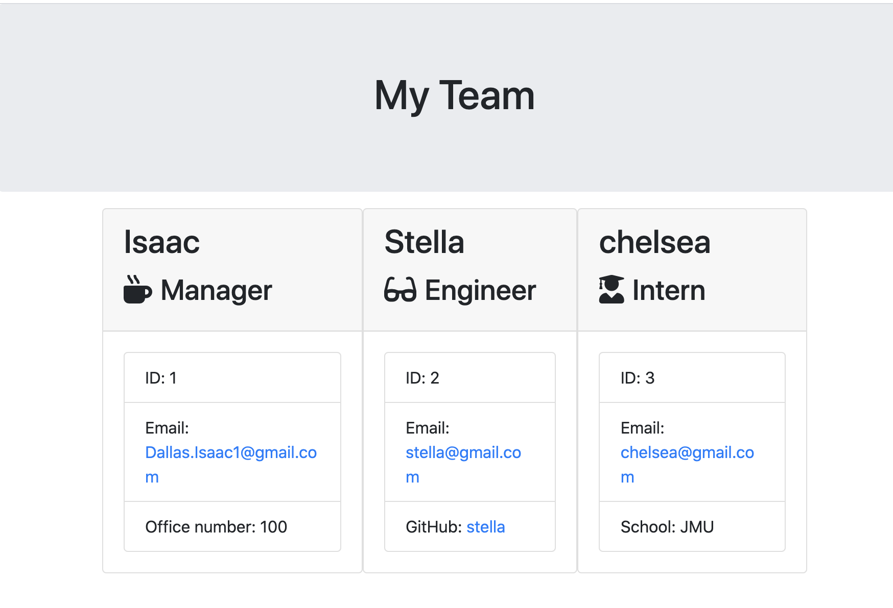
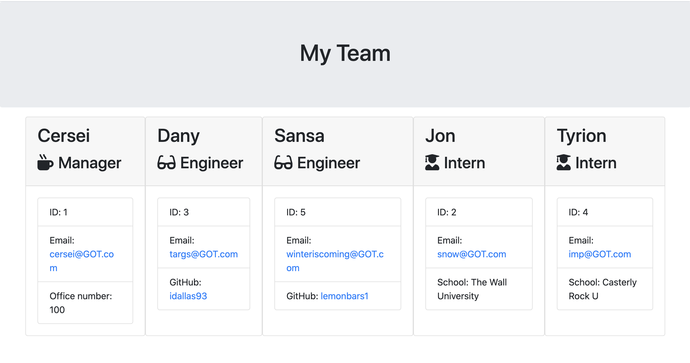

# My team template engine summary

This application is a Node CLI that takes in information about employees and generates an HTML webpage that displays summaries for each person. This app also includes tests that are all passed. 

**[Video of working application](https://youtu.be/CNgu8uQm5dw)**

## Project details

 This prompts the user to pick a role and then add information about that role (manager, engineer, intern, etc.). The user can input any number of team members, and they may be a mix of engineers and interns. This app also passes all unit tests. When the user has completed building the team, the application creates an HTML file that displays a nicely formatted team roster based on the information provided by the user. 

* The prompts built using inquirer ask difference questions based on role, for example an engineer is asked for github account link, intern is asked for school name, and manager is asked for office number. p

* The app runs as a Node CLI to gather information about each employee.

* Below are some pictures of what the finished team page looks...

## App features

* The app is functional

* The app has a GitHub repository with a unique name and a README describing the project.

* The sser can use the CLI to generate an HTML page that displays information about their team.

* All tests pass.

### Classes
The project includes these classes: `Employee`, `Manager`, `Engineer`,
`Intern`. The tests for these classes in the `tests` directory all pass.

The first class is an `Employee` parent class with the following properties and
methods:

  * name
  * id
  * email
  * getName()
  * getId()
  * getEmail()
  * getRole() // Returns 'Employee'

The other three classes extend `Employee`. 

In addition to `Employee`'s properties and methods, `Manager` also has:

  * officeNumber

  * getRole() // Overridden to return 'Manager'

In addition to `Employee`'s properties and methods, `Engineer`  also has

  * github  // GitHub username

  * getGithub()

  * getRole() // Overridden to return 'Engineer'

In addition to `Employee`'s properties and methods, `Intern` also has:

  * school 

  * getSchool()

  * getRole() // Overridden to return 'Intern'

### User input

The project prompt the user to build an engineering team. An engineering
team consists of a manager, and any number of engineers and interns.

### Roster output

The project generates a `team.html` page in the `output` directory, that displays a nicely formatted team roster. Each team member displays the following:

  * Name

  * Role

  * ID

  * Role-specific property (School, link to GitHub profile, or office number)

## Bonus

* The he application to your portfolio.
